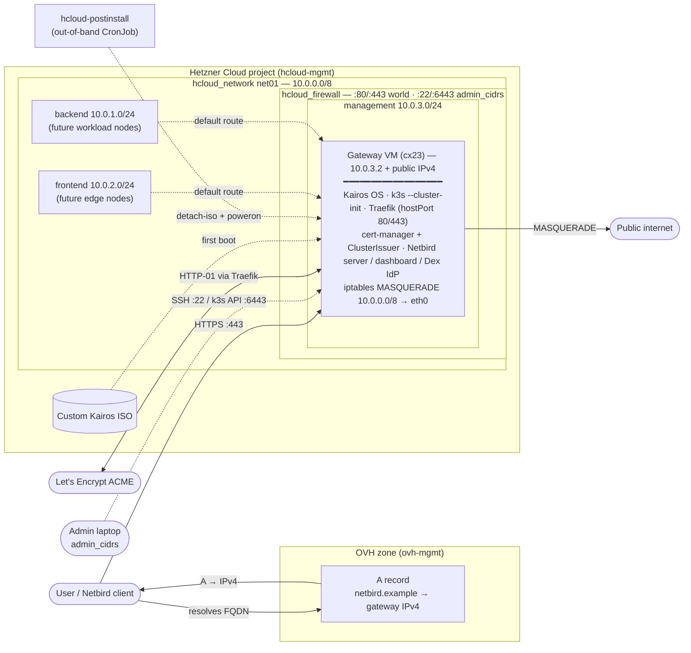
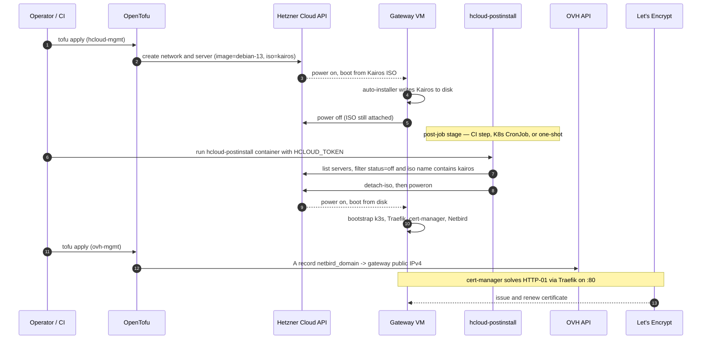
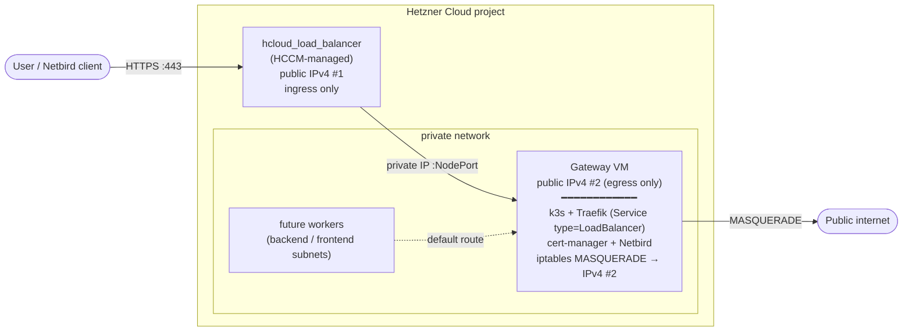

# hcloud-kairos-platform

[](https://github.com/ocalzi/hcloud-kairos-platform/actions/workflows/terraform-validate.yml)
[](https://github.com/ocalzi/hcloud-kairos-platform/actions/workflows/postinstall-build.yml)
[](https://github.com/ocalzi/hcloud-kairos-platform/blob/main/hcloud-postinstall/README.md#run-it)

Smallest possible production-grade Kubernetes on Hetzner Cloud — minimal cost,
fully integrated with Hetzner primitives.

Stack as shipped: **Kairos** + **k3s** + **Traefik** + **cert-manager** + **Netbird**.
The HCCM / Cilium / Hetzner CSI / Gateway API upgrade path is documented
below (see *Alternative: split ingress and egress with HCCM*) but
intentionally not in the base showcase — each one adds operational surface
that a single-VM demo doesn't earn.

Author: **Olivier Calzi** — Golden Kubestronaut
([github.com/ocalzi](https://github.com/ocalzi))

This is a public showcase tied to a LinkedIn series and accompanying blog
posts. It is **not** a one-click installer — it is a reference implementation
you can read end-to-end in an evening and adapt.

## What's in this repo

```
hcloud-kairos-platform/
├── hcloud-mgmt/         # OpenTofu: network, gateway, workers
├── ovh-mgmt/            # OpenTofu: public DNS record for the gateway
└── hcloud-postinstall/  # Helper image: detach the Kairos installer ISO
                         # and power VMs back on after first install.
```

Three components, all small. Each ships with its own README explaining what
it does and how to run it. Bootstrap order is `hcloud-mgmt` →
`hcloud-postinstall` → `ovh-mgmt` (the DNS record consumes the gateway IP
that `hcloud-mgmt` produces).

## Architecture at a glance



**What the diagram shows.** The platform is a single Kairos VM that wears
every hat: k3s control plane, ingress edge (Traefik on hostPort 80/443,
no `Service type=LoadBalancer` involved), TLS termination
(cert-manager + Let's Encrypt HTTP-01), self-hosted VPN coordination
(Netbird server, dashboard, embedded Dex IdP), **and** the NAT default
gateway for the private network so future workers in `frontend` /
`backend` subnets reach the internet through it.

A `hcloud_firewall` sits in front of the VM: 80 and 443 are open to the
world (Traefik serves HTTPS and cert-manager solves the ACME HTTP-01
challenge over the same `:80`), while SSH (22) and the k3s API (6443)
are restricted to `var.admin_cidrs` — typically your laptop's `/32`. A
leaked kubeconfig or password cannot then be exercised from a random IP.

DNS lives in the sibling `ovh-mgmt` project on different credentials so a
botched zone change can't break compute, and vice versa.

The Kairos ISO is uploaded once. `hcloud-postinstall` is the out-of-band
helper that runs *after* `tofu apply` to detach the installer ISO and
power the VM back on — without it the VM stays off forever.

## Orchestration: how a fresh apply ships a working cluster

The boot-and-install dance is split across **three actors**: OpenTofu
(declarative infrastructure), the Kairos ISO (installer that runs on
the VM itself), and `hcloud-postinstall` (post-job that bridges the
gap between "VM installed itself and powered off" and "VM running k3s").



The pieces *can* run in the same pipeline (one CI job: `tofu apply` →
`hcloud-postinstall` → `tofu apply ovh-mgmt`) or be split across forges
— the `hcloud-postinstall` container is shipped to GHCR/Quay precisely
so any forge with a Hetzner API token can invoke it as a post-job
without local tooling.

**Why post-job and not a Tofu provisioner.**
A `null_resource` + `local-exec` would couple ISO detach to the
OpenTofu lifecycle, which means a `tofu destroy` would also try to
unwind the detach (no-op, but it adds plan noise) and a `tofu apply`
that already-completed-once would skip the detach on subsequent runs
because the resource is "already created." Splitting the detach into
a separate idempotent container lets it run on a `CronJob` indefinitely,
catching every freshly-installed Kairos VM the next time a worker
is added — without OpenTofu state ever needing to know about it.

## Background

- Blog series: https://portefolio.calzi.eu/blog/hetzner-hccm-kairos
- Upstream Hadron PR adding Hetzner cloud-provider hooks: https://github.com/kairos-io/hadron/pull/379
- This is my first OpenTofu project after several years on Terraform — the
  layout, comments, and module split reflect that bias.

## Why this exists

Most "k8s on a single cloud" tutorials either:
- pull in a managed control plane (defeats the cost angle), or
- skip the cloud-provider integration entirely (no LoadBalancer Services,
  no volume provisioning, no coherent node/IP story when you grow past
  one VM).

This repo takes a third path: a **single Kairos VM that already behaves
like a small platform** — k3s with Traefik on hostPort 80/443, cert-manager
issuing real Let's Encrypt certs, Netbird as a self-hosted control plane,
and iptables MASQUERADE so future workers in private subnets reach the
internet through it. Costs a coffee a day, no managed anything.

When you outgrow the single-VM shape, the natural next step is the
HCCM / CSI / Cilium / Gateway API combo that managed clusters give you for
free. The next section describes the first half of that path —
splitting the gateway's ingress and egress IPs with an HCCM-managed
LoadBalancer.

## Alternative: split ingress and egress with HCCM

The single-VM showcase makes the gateway's public IPv4 wear two hats at
once:

- **Inbound** — HTTPS for Netbird (dashboard + management) lands on `:443`.
- **Outbound** — NAT MASQUERADE rewrites every packet leaving the private
  network to use the same IPv4 as source.

Fine for a one-machine demo. Not the shape you want for anything
multi-node, anything multi-tenant, or anything that needs an ingress IP
that survives a gateway VM swap.

The natural upgrade is to install
[Hetzner Cloud Controller Manager (HCCM)](https://github.com/hetznercloud/hcloud-cloud-controller-manager)
into k3s and split the two flows onto two distinct Hetzner public IPs:



What changes:

- **Ingress IP becomes the LB's IPv4.** OVH A record points there, not at
  the gateway VM. The LB lives independently of the VM, so replacing the
  gateway no longer rotates the public DNS target — clients keep
  resolving to the same IP across blue/green VM swaps.
- **Egress IP stays the gateway VM's IPv4.** Upstream allow-lists (e.g.
  third-party APIs that whitelist source IPs) can pin against it without
  fearing it'll move every time the LB reconciles.
- **Multi-replica Netbird becomes possible.** HCCM watches Node objects
  and registers each healthy node as a backend; failed ones get pulled
  out automatically. The current hostPort design pins everything to one
  node.
- **Traefik moves off `hostPort`** to a regular
  `Service type=LoadBalancer`. HCCM creates the Hetzner LB, sets the
  Service's `EXTERNAL-IP`, and points the LB at every node's NodePort.
- **HCCM needs `HCLOUD_LOAD_BALANCERS_USE_PRIVATE_IP=true`** when the
  cluster lives on a private network — without it HCCM tries to register
  backends on the node's public IPv4, which both defeats the
  egress-isolation point and breaks entirely if you firewalled the public
  side of the nodes.
- **`--disable=servicelb` can stay or go.** With Traefik off hostPort
  there's nothing for klipper-lb to fight over, so leaving servicelb
  enabled would just mean two LB controllers (klipper + HCCM) react to
  the same Service. Cleaner to keep it disabled so HCCM is the single
  owner.

Cost: ~**€5/month per Hetzner LB** plus one more controller to babysit.
For a showcase that's not worth it; for a real platform it usually is.
This repo deliberately leaves it to the reader as the obvious next step
rather than shipping a half-baked HCCM Helm install in the base config.

## AI-assisted authorship

Per [Linux Foundation generative-AI guidance](https://www.linuxfoundation.org/legal/generative-ai)
and the spirit of [Model Card](https://modelcards.withgoogle.com/about) /
disclosure best practice:

- Significant portions of the OpenTofu HCL, shell script, CI workflows, and
  prose in this repository were drafted with the assistance of
  **Anthropic Claude (Opus 4.7)** via [Claude Code](https://claude.com/claude-code).
- Every file has been read, reviewed, edited, and accepted by a human
  (Olivier Calzi). The author retains responsibility for correctness,
  security, and licensing compliance under the MIT terms below.
- No third-party copyrighted code was knowingly ingested into the prompt
  context. All design choices — module split, two-phase boot model,
  `hcloud_image` data-source lookup, `ignore_changes` policy — were
  human-directed; the AI produced the boilerplate to express them.
- AI-assisted commits in this repository are signed off with a
  `Co-Authored-By: Claude` trailer per the Linux DCO convention extension
  for AI co-authorship, so blame/`git log` makes the provenance auditable.

If you reuse or fork this code, the same review discipline is recommended.

## License

[MIT](LICENSE).
