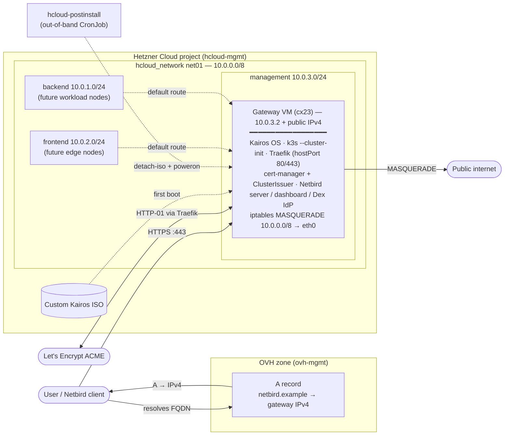

# hcloud-kairos-platform

Smallest possible production-grade Kubernetes on Hetzner Cloud — minimal cost,
fully integrated with Hetzner primitives.

Stack: **Kairos** + **k3s** + **HCCM** + **Cilium** + **cert-manager** + **Gateway API**.

Author: **Olivier Calzi** — Golden Kubestronaut
([github.com/ocalzi](https://github.com/ocalzi))

This is a public showcase tied to a LinkedIn series and accompanying blog
posts. It is **not** a one-click installer — it is a reference implementation
you can read end-to-end in an evening and adapt.

## What's in this repo

```
hcloud-kairos-platform/
├── hcloud-mgmt/         # OpenTofu: network, gateway, workers
├── ovh-mgmt/            # OpenTofu: public DNS record for the gateway
└── hcloud-postinstall/  # Helper image: detach the Kairos installer ISO
                         # and power VMs back on after first install.
```

Three components, all small. Each ships with its own README explaining what
it does and how to run it. Bootstrap order is `hcloud-mgmt` →
`hcloud-postinstall` → `ovh-mgmt` (the DNS record consumes the gateway IP
that `hcloud-mgmt` produces).

## Architecture at a glance



**What the diagram shows.** The platform is a single Kairos VM that wears
every hat: k3s control plane, ingress edge (Traefik on hostPort 80/443,
no `Service type=LoadBalancer` involved), TLS termination
(cert-manager + Let's Encrypt HTTP-01), self-hosted VPN coordination
(Netbird server, dashboard, embedded Dex IdP), **and** the NAT default
gateway for the private network so future workers in `frontend` /
`backend` subnets reach the internet through it.

DNS lives in the sibling `ovh-mgmt` project on different credentials so a
botched zone change can't break compute, and vice versa.

The Kairos ISO is uploaded once. `hcloud-postinstall` is the out-of-band
helper that runs *after* `tofu apply` to detach the installer ISO and
power the VM back on — without it the VM stays off forever.

## Background

- Blog series: https://portefolio.calzi.eu/blog/hetzner-hccm-kairos
- Upstream Hadron PR adding Hetzner cloud-provider hooks: https://github.com/kairos-io/hadron/pull/379
- This is my first OpenTofu project after several years on Terraform — the
  layout, comments, and module split reflect that bias.

## Why this exists

Most "k8s on a single cloud" tutorials either:
- pull in a managed control plane (defeats the cost angle), or
- skip the cloud-provider integration (no LoadBalancer Services, no volume
  provisioning, no node IP coherence).

This repo wires Kairos + k3s into Hetzner the way a managed cluster would
expect: HCCM for node/loadbalancer reconciliation, the Hetzner CSI driver for
PVs, Cilium for the dataplane, and Gateway API on top for ingress. The result
is a cluster that costs a coffee a day and behaves like the bigger ones.

## AI-assisted authorship

Per [Linux Foundation generative-AI guidance](https://www.linuxfoundation.org/legal/generative-ai)
and the spirit of [Model Card](https://modelcards.withgoogle.com/about) /
disclosure best practice:

- Significant portions of the OpenTofu HCL, shell script, CI workflows, and
  prose in this repository were drafted with the assistance of
  **Anthropic Claude (Opus 4.7)** via [Claude Code](https://claude.com/claude-code).
- Every file has been read, reviewed, edited, and accepted by a human
  (Olivier Calzi). The author retains responsibility for correctness,
  security, and licensing compliance under the MIT terms below.
- No third-party copyrighted code was knowingly ingested into the prompt
  context. All design choices — module split, two-phase boot model,
  `hcloud_image` data-source lookup, `ignore_changes` policy — were
  human-directed; the AI produced the boilerplate to express them.
- AI-assisted commits in this repository are signed off with a
  `Co-Authored-By: Claude` trailer per the Linux DCO convention extension
  for AI co-authorship, so blame/`git log` makes the provenance auditable.

If you reuse or fork this code, the same review discipline is recommended.

## License

[MIT](LICENSE).
